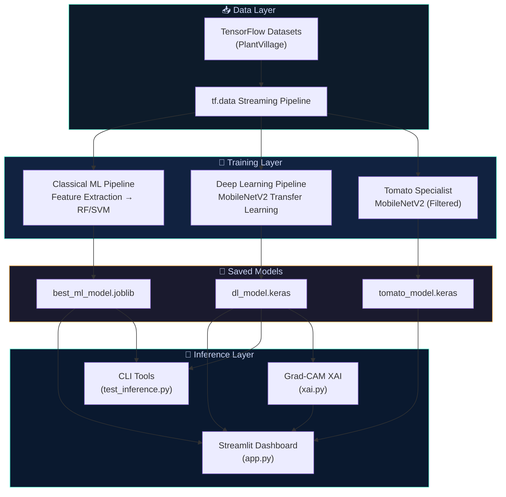
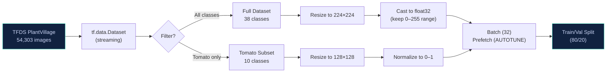
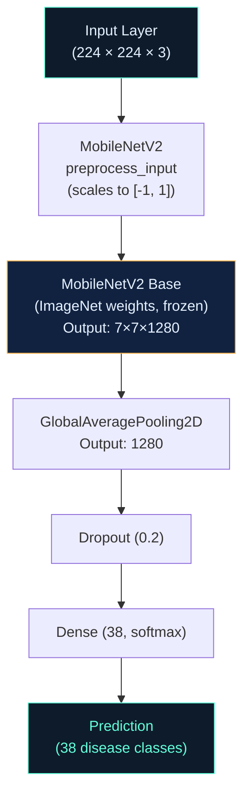
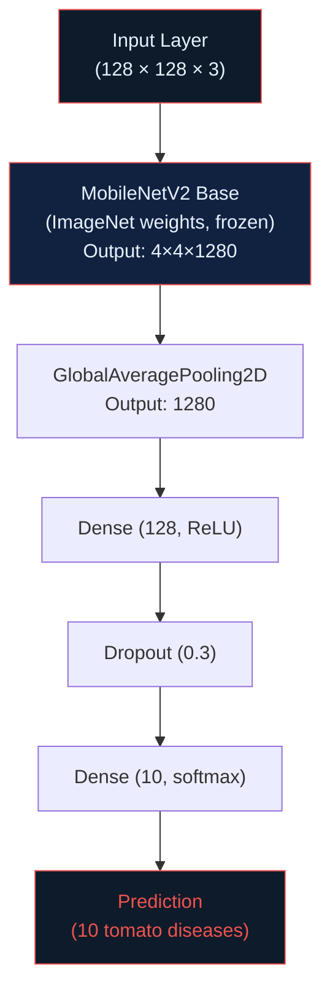
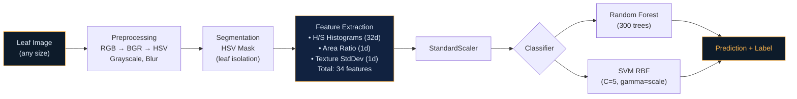
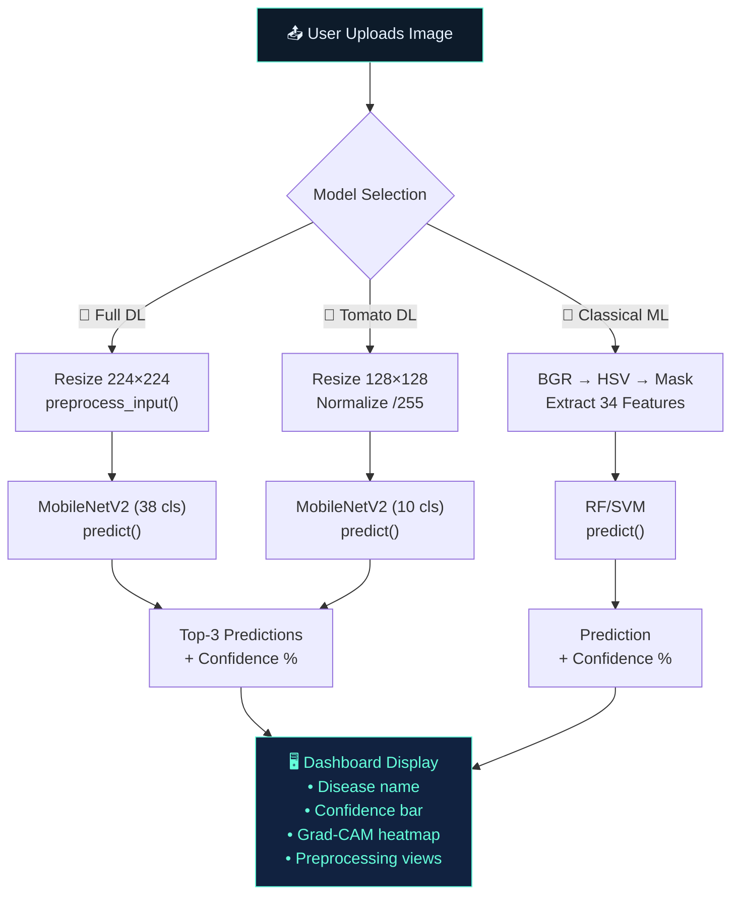
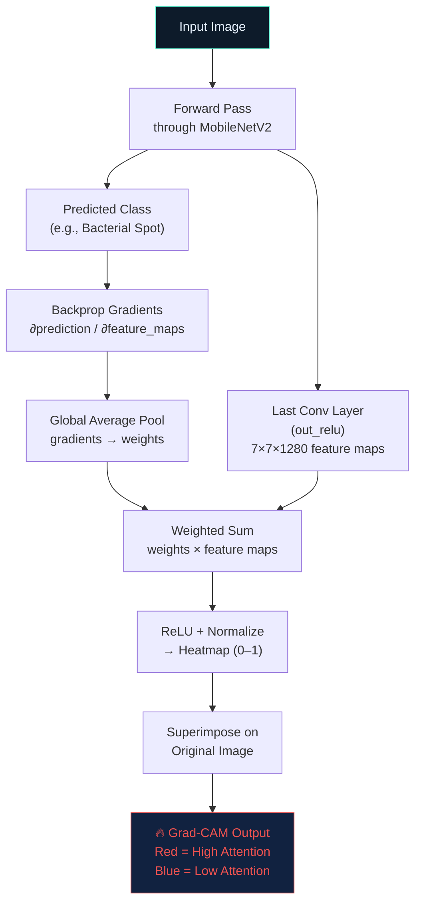
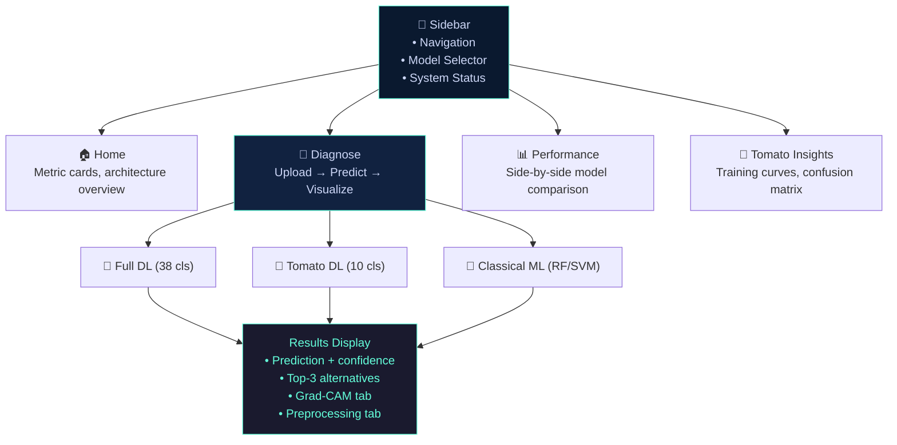

# 🌿 AgriVision Pro — AI Plant Disease Detection System

An end-to-end, production-ready pipeline for detecting and classifying plant diseases from leaf images. Combines **Deep Learning** (MobileNetV2), **Classical Machine Learning** (Random Forest / SVM), and **Explainable AI** (Grad-CAM) into a unified diagnostic platform with a premium Streamlit dashboard.

---

## 📑 Table of Contents

- [System Architecture](#-system-architecture)
- [Project Structure](#-project-structure)
- [Data Pipeline](#-data-pipeline)
- [Model Architecture](#-model-architecture)
- [Inference Pipeline](#-inference-pipeline)
- [Explainable AI (Grad-CAM)](#-explainable-ai-grad-cam)
- [Streamlit Dashboard](#-streamlit-dashboard)
- [Getting Started](#-getting-started)
- [CLI Tools](#-cli-tools)
- [Results](#-results)

---

## 🏗️ System Architecture

The system is composed of four major subsystems: **Data Ingestion**, **Training**, **Inference**, and **Visualization**. They interact as follows:



---

## 📂 Project Structure

```
Upgraded_Plant_Disease_Project/
│
├── app.py                          # 🖥️  Streamlit dashboard (main UI)
├── run_pipeline.py                 # 🚀 CLI orchestrator for full training
├── train_tomato_model.py           # 🍅 Standalone tomato classifier trainer
├── test_inference.py               # 🧪 CLI inference tester (all models)
├── test_tomato_model.py            # 🧪 CLI tomato model tester
├── AgriVision_Master_Pipeline.ipynb# 📓 Interactive Jupyter notebook
├── requirements.txt                # 📦 Python dependencies
│
├── src/imagerie/                   # 🔧 Core processing modules
│   ├── preprocessing.py            #    Image preprocessing (grayscale, HSV, blur)
│   ├── segmentation.py             #    Leaf segmentation (HSV mask, edges, K-means)
│   ├── features.py                 #    Feature extraction (histograms, texture)
│   ├── tfds_pipeline.py            #    TFDS data loading & streaming
│   ├── ml_pipeline.py              #    Classical ML training (RF, SVM)
│   ├── dl_pipeline.py              #    Deep Learning training (MobileNetV2)
│   ├── xai.py                      #    Grad-CAM explainability
│   └── visualization.py            #    Plotting utilities
│
├── outputs/
│   ├── notebook_run/               # Full model outputs
│   │   ├── dl/dl_model.keras       #    Trained DL model (38 classes)
│   │   ├── best_ml_model.joblib    #    Trained ML model + LabelEncoder
│   │   ├── run_summary.json        #    Training metrics & class list
│   │   └── confusion_matrix_ml.png #    ML confusion matrix
│   │
│   └── tomato_model/               # Tomato specialist outputs
│       ├── tomato_model.keras       #    Trained tomato DL model (10 classes)
│       ├── tomato_model_meta.json   #    Class names & config
│       ├── training_history.png     #    Accuracy/loss curves
│       ├── confusion_matrix.png     #    Confusion matrix heatmap
│       ├── sample_predictions.png   #    Visual prediction samples
│       └── classification_report.txt#    Precision/Recall/F1 report
│
└── venv/                           # Python virtual environment
```

---

## 🔄 Data Pipeline

All data is streamed from **TensorFlow Datasets (TFDS)** — no manual downloading required.



> **Important**: The Full DL model receives images in `[0, 255]` range because MobileNetV2's built-in `preprocess_input` handles the normalization internally. The Tomato model uses standard `[0, 1]` normalization.

---

## 🧠 Model Architecture

### Model 1: Full DL — MobileNetV2 (38 Classes)



### Model 2: Tomato DL — MobileNetV2 (10 Classes)



### Model 3: Classical ML Pipeline



---

## 🔬 Inference Pipeline

When a user uploads an image (via Streamlit or CLI), the system routes through the selected model:



---

## 🔥 Explainable AI (Grad-CAM)

Grad-CAM (Gradient-weighted Class Activation Mapping) reveals **where** the model is looking when making a diagnosis. This builds trust by showing the neural network's reasoning.



**How it handles nested models**: The system automatically unwraps the MobileNetV2 base from inside the classifier wrapper, hooks into the `out_relu` layer for gradient computation, and reconstructs the forward pass through the remaining classification head layers.

---

## 🖥️ Streamlit Dashboard

The dashboard provides 4 pages accessible via the sidebar:



### Model Selector

| Selection | Model File | Input Size | Normalization | Classes |
|-----------|-----------|:----------:|:-------------:|:-------:|
| 🌿 Full DL | `dl_model.keras` | 224×224 | `preprocess_input` ([-1,1]) | 38 |
| 🍅 Tomato DL | `tomato_model.keras` | 128×128 | `/255.0` ([0,1]) | 10 |
| 🤖 Classical ML | `best_ml_model.joblib` | Any | N/A (feature-based) | 38 |

---

## 🚀 Getting Started

### 1. Setup Environment

```bash
python -m venv venv
.\venv\Scripts\activate        # Windows
pip install -r requirements.txt
```

### 2. Train Models

```bash
# Train full pipeline (ML + DL, 38 classes)
python run_pipeline.py --run-dl --max-samples 20000 --dl-epochs 5

# Train tomato specialist (10 classes)
python train_tomato_model.py --epochs 5
```

### 3. Launch Dashboard

```bash
streamlit run app.py
```

---

## 🧪 CLI Tools

### Test All Models on an Image

```bash
python test_inference.py "path/to/leaf.jpg"
# Shows Top-3 DL predictions + ML prediction

python test_inference.py "path/to/leaf.jpg" --gradcam
# Also saves dl_attention_result.png
```

### Test Tomato Model Only

```bash
python test_tomato_model.py "path/to/tomato_leaf.jpg"
# Shows Top-3 tomato disease predictions
```

---

## 📊 Results

### Tomato Specialist Model (10 classes)

| Metric | Score |
|--------|:-----:|
| **Validation Accuracy** | **95%** |
| Weighted Precision | 0.95 |
| Weighted Recall | 0.95 |
| Weighted F1 | 0.95 |

**Per-class highlights:**

| Disease | Precision | Recall | F1 |
|---------|:---------:|:------:|:--:|
| Bacterial Spot | 0.98 | 0.96 | 0.97 |
| Yellow Leaf Curl Virus | 0.99 | 1.00 | 0.99 |
| Tomato Mosaic Virus | 0.97 | 0.97 | 0.97 |
| Healthy | 0.97 | 0.97 | 0.97 |
| Late Blight | 0.90 | 0.97 | 0.94 |

### Classical ML Model (38 classes)

| Model | Accuracy | F1 |
|-------|:--------:|:--:|
| Random Forest (300 trees) | 73% | 0.70 |
| SVM (RBF, C=5) | 72.5% | 0.71 |

---

## 📦 Dependencies

| Package | Purpose |
|---------|---------|
| `tensorflow` | DL training, MobileNetV2, TFDS |
| `tensorflow-datasets` | PlantVillage data streaming |
| `scikit-learn` | RF, SVM, metrics, preprocessing |
| `opencv-python` | Image processing, segmentation |
| `streamlit` | Interactive web dashboard |
| `joblib` | Model serialization (ML) |
| `matplotlib` | Plotting, Grad-CAM colormap |
| `pandas` | Data manipulation |
| `tqdm` | Progress bars |

---

## 📜 License

This project is developed as part of an academic engineering curriculum for plant disease image processing and classification.